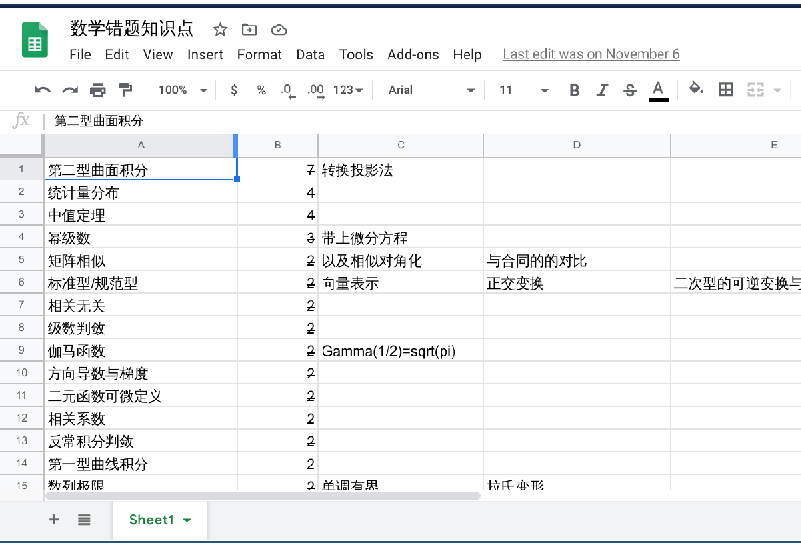

**选择 > 努力！**
**报考时一定要分清专业代码！！！（血的教训）**

2021/4/8,复试已经告一段落，趁着找导师的空闲来写一写上岸的经验贴。

本人报考2021年东南大学网络空间安全的学硕，初试成绩：数学117，计算机网络115，英语77，政治69，总分378，排名34；复试成绩113，学硕总排名37。本科上海普通211生物工程专业，没有相关竞赛和项目，最终三跨上岸，感谢东南给我个读书的机会。

# 初试

## 数学一

数学一内容多,难度大，除了部分大佬以外应该是你花最多精力的科目

我本科期间上的数学课程约等于数学2，所以数一的很多难点相当于从0学起，这着实花了我不少精力。如果你和我的情况相似，务必务必在没上过的知识基础上多下功夫。

比较著名的老师有李永乐,汤家凤,李林,张宇,陈文灯等等

### 视频+讲义

1. 高数

我用的是张宇,基础30讲+高数18讲

张宇高数内容讲的不错,而且开了基础班,一路听听课难度相对较小。汤家凤和李永乐更偏基础一点,看个人选择。

2. 线代

用的李永乐,红皮的线性代数考研辅导,基础班听的张宇,可以全换成李永乐

线代部分公认李永乐最好,但是讲义写的一般,可以结合张宇的来看

1. 概率论

用的张宇,感觉还可以。有推荐郝崇宇的概率班,但是网上很难搜到相应的资料和视频(我自己只找到20年的部分讲义)

其余的讲义还有李正元的复习全书,陈文灯的复习全书之类的,但是听一个老师的视频课最好备着对应的讲义,基本上选一个覆盖的全的一直跟就行了

我用的就是张宇基础30讲+强化36讲+李永乐线代强化

### 习题部分

推荐李永乐660和330,张宇的闭关修炼

不推荐张宇1000题!!!跟考研题目风格差太多

汤家凤有1800题,但是评价感觉不如李永乐的,有时间可以参考

李林660+108很不错

习题集选一本好的做就可以,其他的当个参考

### 真题

真题*最少最少*手动做到2010年左右的,然后前些年的就挑一眼看不出来的题做（我因为真题开始的晚赶进度，实际上最好全都自己手动做）

错了题一定要标注知识点(底下这个图表示我从06-20年真题错的知识点和错的次数),错的最多的一部分先复习基础知识再刷一遍相关的题

真题有时间的话尽量二刷

### 模拟卷

李林6+4 有口碑,必做

李永乐 据说每年题目都差不多

张宇8+4 不推荐 8套卷偏难,4套卷基本偏离考研风格

合工大共创/超越 有口碑 但是超越比较难 我买的共创还有不少错误

还有些其他老师/机构的,但是到时候你自己就能分辨哪些好哪些不好

### 其他的

记得关注每年的大纲变动,一般会有机构做总结

不要看别人吹牛逼数学模拟卷做得很高,看看目标学校的初试过线均分

数学要一直做题,保持手感,慢慢积累

## 专业课-计算机网络

东南的网安偏硬件，所以会有917方向。由于我电路根本没碰过，所以选考计网916，因为有王道在先，复习资料、体系比较完善。

科班学过我就不献丑了，如果和我一样是跨考的话，推荐先用王道起手，内容比较精简，能让你抓住每一章的重点知识，一边看一边做题

王道过完一遍后可以一边看谢希仁的计网，一边对着王道当时不会的知识点查。谢书的课后题我没做（懒），如果有余力的话可以看看那本著名的自顶向下。

据传2022年东南会往916方向加科目，可能是计组或者数据结构，如果加了的话，新加的那一门应该成为你专业课的复习重点。计网在掌握大致脉络后可以每天记一点内容，花太多时间收益不高

不过916网络考察内容还是很广的，408内没怎么涉及的流媒体、信息安全基础（仅谢书内提到的部分）都有涉及，还会在大题内出现伪代码、路由器内部结构等内容，所以一定要准备充分

刷题没啥好说的，408+历年真题，像川大、交大这类只考计网的学校初试试卷也可以参考（交大比较难，涉及到一些效率分析，选择性跳过），还有各类期末考试题，牛客app上也有计网专题内容

## 英语一

我的英语复习没有太大参考价值，仅从11月开始每两到五天一套真题（多做几遍），以及最后一个月抱佛脚背了点作文模版。

但是我能肯定的是英语是一个长期积累的过程，从现在开始背单词（不求多，每天20个总可以吧！背多了考试时也记不住多少的），可以偶尔做一点阅读，进入9-10月份左右开始训练整套试卷。期间要找到自己的薄弱环节提前练习，网课可以看看图一乐，没有必要听那些词汇课

英语没有必要买模拟卷！切记，因为我觉得模拟卷出的都挺烂的。最好的训练方法是抓着真题反复做，而且真题之间难度差异也比较大，能满足不同水平选手的需求。

完型20题但是只占10分 性价比比较低

阅读是大头 老师推荐刘晓艳讲的不错(但是我自己没怎么看)这个需要多做

新题型看刘晓艳 方法讲的很好

翻译和作文会有专门的机构、公众号整理各老师的课程,翻译会教技巧,不过大部分人分差不大。作文会给模板,整理整理自己写一个模板然后练作文的时候往上套

英语不求量大，但求一个长期以来坚持练习的习惯

## 政治

我政治大概10月开始准备，比较晚了，按理说8、9月份合适一些。

- 马哲部分可以看徐涛视频，加强理解
- 毛中特部分和时政结合紧密，视频可看可不看
- 史纲和思修就别看了吧，不要光明正大的摸鱼

除了马哲的部分看了视频，其他的我就买了肖秀荣的那个小册子（叫知识点摘要啥的，比较小一本，只有重点知识点）和1000题（没有用精讲精练），看完一章写一章

习题集可以只买唯一神肖秀荣1000题,推荐至少刷3遍,使用方法（我从11月底开始用这个重刷1000题）参考[1000题高效复习](https://www.zhihu.com/question/358929360/answer/1413097494)

看不太懂的话再问我就可以,这个方法练下来我做肖八选择题平均38

后期各机构会出很多模考卷,必做的是肖八、肖四,前一个选择,后一个选择+背大题

其余老师、机构的模考卷可以适当做,也可以去各类公众号上做那种刷题的小程序

# 复试

C++跟着郑莉的视频/书就可以，自己找语法练习题做做，今年甚至涉及了stl部分；但是最终还是要重视基础的学习，分清主次；一定要自己多手写代码，写了才能明白为什么语法会这么安排。

如果时间充裕的话跨考选手可以在github上找个小项目跟着做（例如端到端聊天+加密软件），我太懒了就没搞

由于2021年网安专硕预计招生250人左右，所以我一开始在系统里看自己专业排名34，心想只要复试不拉大胯应该就稳有学上了，所以看了两遍c++课件过后就摸了，疯狂打游戏，加上毕业设计，直到复试前两个星期才正儿八经的复习准备。

结果到复试前三天的中午，午睡起来睁开眼我才发现！！自己是学硕！！！报成了学硕啊啊啊啊！！！！！！！！！！学硕只招54个啊啊啊啊啊！！！！！

在惊慌失措中跟群友再次确认，我的准考证上的专业代码的确是083900 网络空间安全（学硕），而不是085400 电子信息（专硕）......

所以，**一定一定要分清自己报的是学硕还是专硕啊！！！**

在认清了现实过后，我抓紧时间找了个最现实的对策：在简历表上不是有专业兴趣与规划一栏嘛，找几篇相关的论文准备着，于是接下来的几天我又在反复的看论文与c++面试宝典

整个复试过程实际上来说还是比较顺利的，首先是自我介绍，然后是抽题目问答，C++部分改错有一处关键我没改出来，其余两题多少能说点，因为看过相关内容好几遍了；英语抽到了英译中+英文概括短文；自由问答环节老师先问了我在简历上写的Rabin-Karp算法的基本基本思想，然后问了我专业兴趣一栏写DDoS的原因，正要我想进一步讲时，老师直接说时间不够了（我看了四篇论文，学了两种数据结构啊！！！），最后问有没有安全相关的项目我回答了参与过学校ctf培训（实际就挂了个名，这个回答估计也没有加分作用）就结束了。整个流程下来老师也没追着我问（跨考也没什么可问的），态度还蛮不错的。

东南还是很公平的，本科出身影响相对来说很小，所以复试务必要好好准备专业课！基本专业课能回答几句+英语能说几句应该就有个正常的分数了，项目加分我没有，但是要是经验丰富的话老师肯定会给高分，而且简历写的内容多少要了解一些，不要什么都没准备就往上写。

2022年开始可能要恢复线下面试，其中笔试一张试卷的话就不存在抽题时的运气成分了，一定要好好复习复试科目！！
今年不论是专硕还是学硕复试都有不及格的出现，更加提醒各位要注意复试的分量

# 碎碎念

## 日常安排

1. 保持学习状态，3天3小时>1天9小时+2天摸鱼
2. 提高效率而不是堆时间，比如我上午有效时间仅在8:30-11:00，下午的有效时间在4：30-5：30（容易困，经常摸鱼看动画），晚上则19：30-22：00，而且只有上午和晚上一部分时间在搞数学和专业课，所以尽量让自己精力充沛的去学习，别跟我一样固定20分钟玩一会手机
3. 放松方式看个人，我有时候会运动，更多的时候在宿舍打游戏或者干脆睡觉去，别把自己逼得太紧或者感动坏了，该吃吃该喝喝

## misc

认清自己的优势劣势，合理分配复习时间是很重要的，也不要病态地追求单科高分，你是要上岸而不是考数学150

考研不易，上岸不易。网安可能在最近几年会更热门（作为避开cs内卷的备选），所以了解各校的招生以及复试情况还是很有必要的，信息收集也是考研的重要环节。

欢迎加入东南网安考研群：761240530

**放平心态去备考，祝各位前程似锦。**
